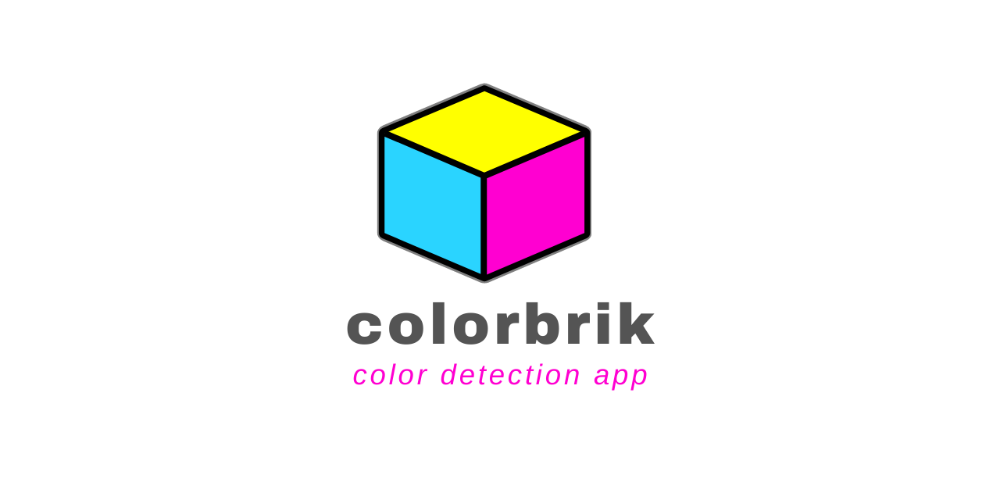

# colorbrick
A production-ready webapp built in Python Flask .🌶 Primary color analysis in images with OpenCV and Scikit-image.

Built on top of the color detection technique explained in this article:

The front-end is built in Javascript, HTML and CSS. The Material CSS Framework is used.

The initial page accepts upload of an image from the disk or direct access to the webcam (if on mobile)

