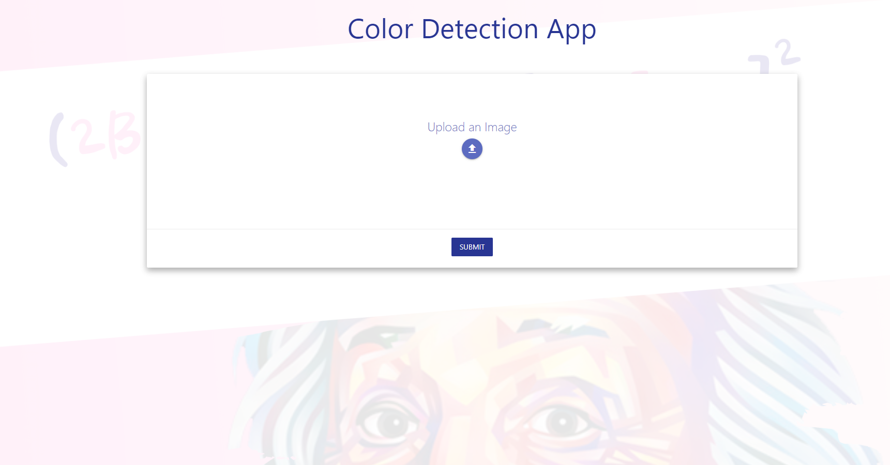
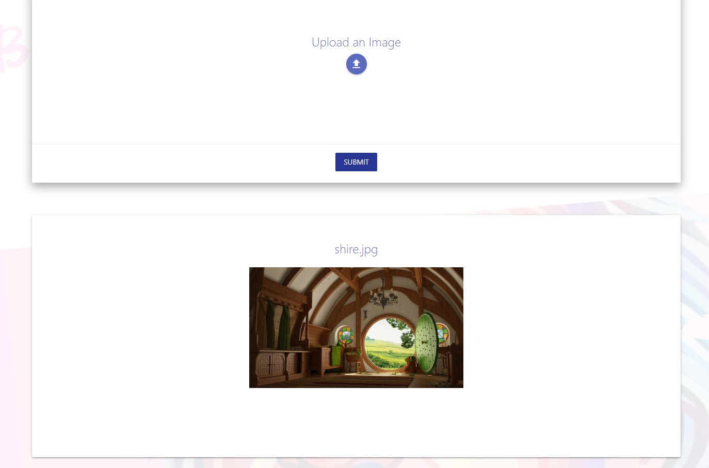
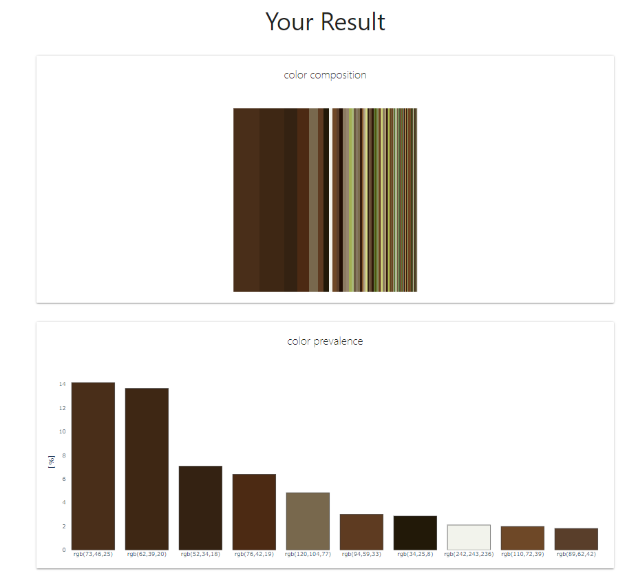
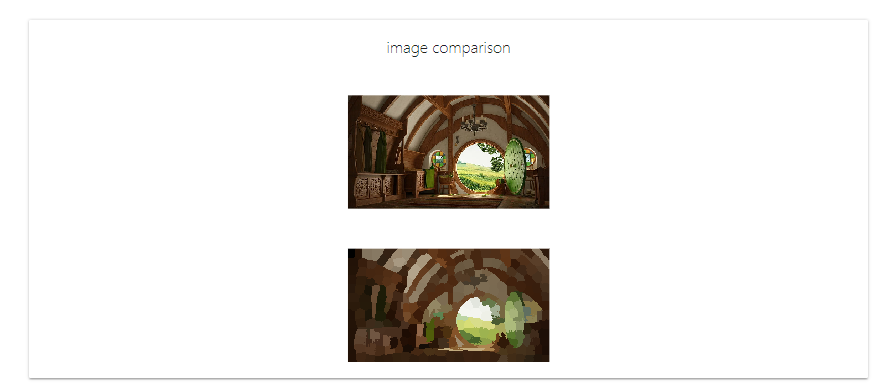

# colorbrick
A tiny production-ready webapp built in Python Flask 🌶 Primary color analysis in images with OpenCV and Scikit-image.

Built on top of the color detection technique explained in this article:

[](https://gcgrossi.github.io/color-detection/)

## Front-End

written in

[]()
[]()
[]()

## Back-End
written in:

[]()
[]()

performs SLIC clustering algorithm and Region Adjacency Graph merging using mainly the following libraries:

[]()
[]()
[]()

## Deployment
the files ```requirements.txt``` and ```app.yaml``` are configured for correct deployment on Google App Engine.

## Colorbrick in Action

### Home page



Accepts upload of an image from the disk or direct access to the webcam (if on mobile).



### Results page

After processing a Landing page with the analysis report is displayed. The graphs are contructed using

[]()






